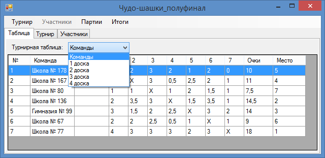

**Описание проекта**
Программа, облегчающая проведение шашечных турниров по круговой системе: заполнение турнирной таблицы ("шахматки"), подсчёт очков и определение мест участников.

#### Системные требования

* Windows XP/Vista/7/8/8.1
* .NET Framework 4
На Windows 8/8.1 программа работает сразу. На Windows XP/Vista/7 может понадобиться установка [.NET Framework 4](http://www.microsoft.com/ru-ru/download/details.aspx?id=17718).
